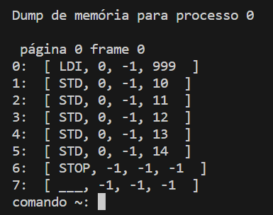

Integrantes do grupo:Patrick Bomm e Lucas Barros

## Seção Implementação:

Limitações:

A memória ainda não é protegida por contexto, portanto não há proteção de acesso para os programas e nem switch para o
modo kernel.

Não há processo de escalonamento nem multiprogramação no sentido de que um processo roda até o fim e os pedidos de E/S
não o bloqueiam nem executam outro processo.

Apesar de uso de paginação, não há memória virtual e carregamento preguiçoso (lazy) ou antecipado (eager) com uso de interrupção de falta de página (page fault).

## Introdução
Para compilar o código, é necessário ter o JDK instalado em sua máquina e um compilador de sua escolha.

## JDK
Utilizamos o JDK Java 19.

## Executando o projeto
Para executar o código, primeiro navegue até o diretório "src" utilizando o comando cd e em seguida compile o arquivo Shell.java.

```
cd src
javac Shell.java
```

Após isto, rode o projeto com:

```
java Shell
```

## Seção de Programas
Implementadas:
Gerente de memória com paginação
Gerente de processos

## Seção Saídas

Para criar um programa deve-se utilizar o comando "criar" e o nome do programa que deseja criar um processos, separado
espaço, como no exemplo:


Desse forma, um processo será criado no processControlBlock e será devolvido o id desse processo. Em seguida, pode-se
utilizar o comando listaProcessos para que a lista de processos, já criados, seja printada na tela, com seus respectivos status.


Utilizando a instrução "dump" mais o id do processo, é listado o conteúdo do PCB e o conteúdo da partição da memória do processo
com essa id.



Para desalocar um processo do PCB, utiliza-se a instrução "desaloca" e o id do processo desejado 


E para finalizar o programa,
basta utilizar o comando "exit".
